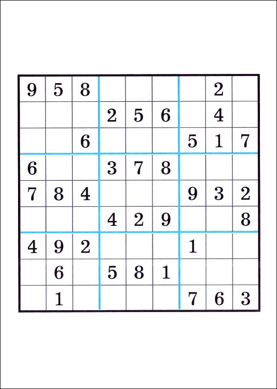

# Jogo de Sudoku

Escreva um código que irá criar um jogo de sudoku

  ## Requisitos
    Deve-se ter um menu interativo onde poderemos escolher entre as seguintes opções:
        1. Iniciar um novo o jogo: Deve-se exibir na tela o jogo inicial, com os espaços preenchidos somente pelos números iniciais (usar os args do método main para informar os números iniciais e suas devidas posiçõers);

        2. Colocar um novo número: Deve-se solicitar as seguintes informações do jogador (número a ser colocado, indice horizontal e indice vertical do número), não se deve permitir que seja colocado um número em uma posição que já esteja preenchida ( seja número fixo ou informado pelo jogador);

        3. Remover um número: deve-se solicitar os índices verticais e horizontais do número que deseja remover ( caso o número seja um número fixo do jogo deve-se exibir uma mensagem informado que o número não pode ser removido);

        4. Verificar jogo: Vizualizar a situação atual do jogo;

        5. Verificar status do jogo: Deve-se verificar o status atual do jogo ( não iniciado, incompleto e completo) e se contém ou não erros ( o jogo está errado quando tem números em posições conflitantes) todos os status do jogo podem conter ou não erros, exceto o status não iniciado que é sempre sem erro;
        6. Limpar: remove todos os números informados pelo usuário e mantém os fixos do jogo;

        7. finalizar o jogo: Se o jogo estiver com todos os espaços preenchidos de forma válida o jogo é encerrado, senão informar ao usuário que ele deve preencher todos os espaços com seus respectivos números;

  ## Extras (requisitos opcionais)
    1. Usar algum ambiente gráfico ( AWT, Swing) para criação do jogo
    2. ter a opção de colocar números de rascunho nos quadrados, para isso deve-se seguir o modelo proposto na sessão modelo de rascunho:

  ### modelo com números
  

  ### modelo de rascunho
  